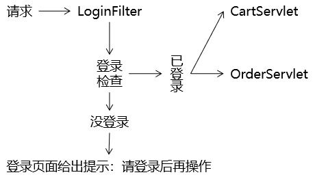

# day12 Filter&Listener&书城项目第五阶段

## 第一章 Filter

### 1. 目标

* 了解什么是Filter
* 了解Filter的作用
* 掌握Filter的使用
* 了解Filter的生命周期
* 掌握过滤器链的使用

### 2. 内容讲解

#### 2.1 Filter的概念

Filter：一个实现了特殊接口(Filter)的Java类. 实现对请求资源(jsp,servlet,html,)的过滤的功能.  过滤器是一个运行在服务器的程序, 优先于请求资源(Servlet或者jsp,html)之前执行. 过滤器是javaweb技术中**最为实用**的技术之一

#### 2.2 Filter的作用

Filter的作用是对目标资源(Servlet,jsp)进行过滤，其应用场景有: 登录权限检查,解决网站乱码,过滤敏感字符等等

#### 2.3 Filter的入门案例

##### 2.3.1 案例目标

实现在请求到达ServletDemo01之前解决请求参数的中文乱码

##### 2.3.2 代码实现

###### 2.3.2.1 创建ServletDemo01

web.xml代码

```xml
<servlet>
    <servlet-name>servletDemo01</servlet-name>
    <servlet-class>com.atguigu.ServletDemo01</servlet-class>
</servlet>
<servlet-mapping>
    <servlet-name>servletDemo01</servlet-name>
    <url-pattern>/ServletDemo01</url-pattern>
</servlet-mapping>
```

ServletDemo01代码

```java
package com.atguigu.servlet;

import javax.servlet.ServletException;
import javax.servlet.http.HttpServlet;
import javax.servlet.http.HttpServletRequest;
import javax.servlet.http.HttpServletResponse;
import java.io.IOException;

/**
 * @author Leevi
 * 日期2021-05-18  08:53
 */
public class ServletDemo01 extends HttpServlet {
    @Override
    protected void doPost(HttpServletRequest request, HttpServletResponse response) throws ServletException, IOException {
        doGet(request, response);
    }

    @Override
    protected void doGet(HttpServletRequest request, HttpServletResponse response) throws ServletException, IOException {
        String username = request.getParameter("username");
        System.out.println("ServletDemo01接收到了一个请求..."+username);
    }
}
```

前端页面代码

```html
<!DOCTYPE html>
<html lang="en">
<head>
    <meta charset="UTF-8">
    <title>首页</title>
</head>
<body>
    <form action="/webday12/demo01" method="post">
        用户名<input type="text" name="username"/><br/>
        <input type="submit"/>
    </form>
</body>
</html>
```

如果此时没有Filter，那么客户端发送的请求直接到达ServletDemo01,中文请求参数就会发生乱码

###### 2.3.2.2 创建EncodingFilter

web.xml代码

```xml
<filter>
    <filter-name>encodingFilter</filter-name>
    <filter-class>com.atguigu.filter.EncodingFilter</filter-class>
</filter>
<filter-mapping>
    <filter-name>encodingFilter</filter-name>
    <!--url-pattern表示指定拦截哪些资源-->
    <url-pattern>/demo01</url-pattern>
</filter-mapping>
```

EncodingFilter代码

```java
package com.atguigu.filter;

import javax.servlet.*;
import javax.servlet.http.HttpServletRequest;
import java.io.IOException;

/**
 * @author Leevi
 * 日期2021-05-18  08:56
 * 编写过滤器的步骤:
 * 1. 写一个类实现Filter接口，并且重写方法
 * 2. 在web.xml中配置该过滤器的拦截路径
 */
public class EncodingFilter implements Filter {
    @Override
    public void destroy() {
        
    }

    @Override
    public void doFilter(ServletRequest req, ServletResponse resp, FilterChain chain) throws ServletException, IOException {
        //解决请求参数的乱码
        HttpServletRequest request = (HttpServletRequest) req;
        request.setCharacterEncoding("UTF-8");

        //每次有请求被当前filter接收到的时候，就会执行doFilter进行过滤处理
        System.out.println("EncodingFilter接收到了一个请求...");

        //这句代码表示放行
        chain.doFilter(req, resp);
    }

    @Override
    public void init(FilterConfig config) throws ServletException {
        
    }

}
```

#### 2.4 Filter的生命周期

##### 2.4.1 回顾Servlet生命周期

###### 2.4.1.1 Servlet的创建时机

Servlet默认在第一次接收请求的时候创建，我们可以通过`<load-on-startup>`标签配置Servlet在服务器启动的时候创建

###### 2.4.1.2 Servlet的销毁时机

Servlet会在服务器关闭或者将项目从服务器上移除的时候销毁

##### 2.4.2 Filter的生命周期和生命周期方法

| 生命周期阶段 | 执行时机         | 生命周期方法                             |
| ------------ | ---------------- | ---------------------------------------- |
| 创建对象     | Web应用启动时    | init方法，通常在该方法中做初始化工作     |
| 拦截请求     | 接收到匹配的请求 | doFilter方法，通常在该方法中执行拦截过滤 |
| 销毁         | Web应用卸载前    | destroy方法，通常在该方法中执行资源释放  |

#### 2.5 过滤器匹配规则

##### 2.5.1 过滤器匹配的目的

过滤器匹配的目的是指定当前过滤器要拦截哪些资源

##### 2.5.2 四种匹配规则

###### 2.5.2.1 精确匹配

指定被拦截资源的完整路径：

```xml
<!-- 配置Filter要拦截的目标资源 -->
<filter-mapping>
    <!-- 指定这个mapping对应的Filter名称 -->
    <filter-name>FilterDemo01</filter-name>

    <!-- 通过请求地址模式来设置要拦截的资源 -->
    <url-pattern>/demo01</url-pattern>
</filter-mapping>
```

上述例子表示要拦截映射路径为`/demo01`的这个资源

###### 2.5.2.2 模糊匹配

相比较精确匹配，使用模糊匹配可以让我们创建一个Filter就能够覆盖很多目标资源，不必专门为每一个目标资源都创建Filter，提高开发效率。

在我们配置了url-pattern为/user/*之后，请求地址只要是/user开头的那么就会被匹配。

```xml
<filter-mapping>
    <filter-name>Target02Filter</filter-name>

    <!-- 模糊匹配：前杠后星 -->
    <!--
        /user/demo01
        /user/demo02
        /user/demo03
		/demo04
    -->
    <url-pattern>/user/*</url-pattern>
</filter-mapping>
```

<span style="color:blue;font-weight:bold;">极端情况：/*匹配所有请求</span>

###### 2.5.2.3 扩展名匹配

```xml
<filter>
    <filter-name>Target04Filter</filter-name>
    <filter-class>com.atguigu.filter.filter.Target04Filter</filter-class>
</filter>
<filter-mapping>
    <filter-name>Target04Filter</filter-name>
    <url-pattern>*.png</url-pattern>
</filter-mapping>
```

上述例子表示拦截所有以`.png`结尾的请求

###### 2.5.2.4 匹配Servlet名称

```xml
<filter-mapping>
    <filter-name>Target05Filter</filter-name>

    <!-- 根据Servlet名称匹配 -->
    <servlet-name>Target01Servlet</servlet-name>
</filter-mapping>
```

#### 2.6 过滤器链

##### 2.6.1 过滤链的概念

一个请求可能被多个过滤器所过滤，只有当所有过滤器都放行，请求才能到达目标资源，如果有某一个过滤器没有放行，那么请求则无法到达后续过滤器以及目标资源，多个过滤器组成的链路就是过滤器链


##### 2.6.2 过滤器链的顺序

过滤器链中每一个Filter执行的<span style="color:blue;font-weight:bold;">顺序是由web.xml中filter-mapping配置的顺序决定</span>的。

##### 2.6.3 过滤器链案例

###### 2.6.3.1 创建ServletDemo01

web.xml代码

```xml
<servlet>
    <servlet-name>servletDemo01</servlet-name>
    <servlet-class>com.atguigu.ServletDemo01</servlet-class>
</servlet>
<servlet-mapping>
    <servlet-name>servletDemo01</servlet-name>
    <url-pattern>/ServletDemo01</url-pattern>
</servlet-mapping>
```

ServletDemo01代码

```java
public class ServletDemo01 extends HttpServlet {
    @Override
    protected void doPost(HttpServletRequest request, HttpServletResponse response) throws ServletException, IOException {
        doGet(request, response);
    }

    @Override
    protected void doGet(HttpServletRequest request, HttpServletResponse response) throws ServletException, IOException {
        System.out.println("ServletDemo01接收到了请求...");
    }
}
```

###### 2.6.3.2 创建多个Filter拦截Servlet

```xml
<filter-mapping>
    <filter-name>TargetChain03Filter</filter-name>
    <url-pattern>/Target05Servlet</url-pattern>
</filter-mapping>
<filter-mapping>
    <filter-name>TargetChain02Filter</filter-name>
    <url-pattern>/Target05Servlet</url-pattern>
</filter-mapping>
<filter-mapping>
    <filter-name>TargetChain01Filter</filter-name>
    <url-pattern>/Target05Servlet</url-pattern>
</filter-mapping>
```

## 第二章 扩展案例: 使用Filter过滤非法字符

### 非法字符过滤案例V1版本

#### 1. 目标

判断评论内容中是否包含某个固定的非法字符串，如果包含则请求无法到达CommentServlet

#### 2. 代码实现

前端页面代码

```html
<!DOCTYPE html>
<html lang="en">
<head>
    <meta charset="UTF-8">
    <title>评论页面</title>
</head>
<body>
    <form action="/webday12/illegal/comment" method="post">
        评论内容<input type="text" name="content"/>
        <input type="submit"/>
    </form>
</body>
</html>
```

EncodingFilter的代码，用于解决乱码

```java
package com.atguigu.filter;

import javax.servlet.*;
import java.io.IOException;

/**
 * @author Leevi
 * 日期2021-05-18  10:19
 */
public class EncodingFilter implements Filter {
    @Override
    public void destroy() {
    }

    @Override
    public void doFilter(ServletRequest req, ServletResponse resp, FilterChain chain) throws ServletException, IOException {
        //解决乱码
        req.setCharacterEncoding("UTF-8");
        resp.setContentType("text/html;charset=UTF-8");

        chain.doFilter(req, resp);
    }

    @Override
    public void init(FilterConfig config) throws ServletException {

    }

}

```

IllegalFilter的代码，用于过滤非法字符

```java
package com.atguigu.filter;

import javax.servlet.*;
import java.io.IOException;

/**
 * @author Leevi
 * 日期2021-05-18  10:22
 */
public class IllegalCharFilter implements Filter {
    @Override
    public void destroy() {
    }

    @Override
    public void doFilter(ServletRequest req, ServletResponse resp, FilterChain chain) throws ServletException, IOException {
        //1. 获取客户端提交的评论内容
        String content = req.getParameter("content");
        if (content != null) {
            //2. 判断content中是否包含非法字符
            if (content.contains("你大爷的")) {
                resp.getWriter().write("评论内容中包含非法字符，评论发布失败!!!");
                return;
            }
        }
        chain.doFilter(req, resp);
    }

    @Override
    public void init(FilterConfig config) throws ServletException {

    }

}
```

CommentServlet的代码，用于发表评论

```java
package com.atguigu.servlet;

import javax.servlet.ServletException;
import javax.servlet.http.HttpServlet;
import javax.servlet.http.HttpServletRequest;
import javax.servlet.http.HttpServletResponse;
import java.io.IOException;

/**
 * @author Leevi
 * 日期2021-05-18  10:17
 */
public class CommentServlet extends HttpServlet {
    @Override
    protected void doPost(HttpServletRequest request, HttpServletResponse response) throws ServletException, IOException {
        doGet(request, response);
    }

    @Override
    protected void doGet(HttpServletRequest request, HttpServletResponse response) throws ServletException, IOException {
        //1. 获取评论内容
        String content = request.getParameter("content");
        //2. 向客户端输出评论内容
        response.getWriter().write("恭喜你评论成功，评论内容是:"+content);
    }
}
```

web.xml中的配置

```xml
<?xml version="1.0" encoding="UTF-8"?>
<web-app xmlns="http://xmlns.jcp.org/xml/ns/javaee"
         xmlns:xsi="http://www.w3.org/2001/XMLSchema-instance"
         xsi:schemaLocation="http://xmlns.jcp.org/xml/ns/javaee http://xmlns.jcp.org/xml/ns/javaee/web-app_4_0.xsd"
         version="4.0">
    <filter>
        <filter-name>EncodingFilter</filter-name>
        <filter-class>com.atguigu.filter.EncodingFilter</filter-class>
    </filter>
    <filter-mapping>
        <filter-name>EncodingFilter</filter-name>
        <url-pattern>/*</url-pattern>
    </filter-mapping>

    <filter>
        <filter-name>IllegalCharFilter</filter-name>
        <filter-class>com.atguigu.filter.IllegalCharFilter</filter-class>
    </filter>
    <filter-mapping>
        <filter-name>IllegalCharFilter</filter-name>
        <url-pattern>/illegal/*</url-pattern>
    </filter-mapping>

    <servlet>
        <servlet-name>CommentServlet</servlet-name>
        <servlet-class>com.atguigu.servlet.CommentServlet</servlet-class>
    </servlet>
    <servlet-mapping>
        <servlet-name>CommentServlet</servlet-name>
        <url-pattern>/illegal/comment</url-pattern>
    </servlet-mapping>
</web-app>
```

### 非法字符过滤案例V2版本

#### 1. 目标

在第一个版本的基础之上，将固定的非法字符串替换成从illegal.txt文件中读取非法字符串

#### 2. 代码实现

IllegalFilter的代码

```java
package com.atguigu.filter;

import javax.servlet.*;
import java.io.BufferedReader;
import java.io.IOException;
import java.io.InputStreamReader;
import java.util.ArrayList;
import java.util.List;

/**
 * @author Leevi
 * 日期2021-05-18  10:22
 */
public class IllegalCharFilter implements Filter {
    private List<String> illegalTextList = new ArrayList<>();
    @Override
    public void destroy() {
    }

    @Override
    public void doFilter(ServletRequest req, ServletResponse resp, FilterChain chain) throws ServletException, IOException {
        //1. 获取客户端提交的评论内容
        String content = req.getParameter("content");
        if (content != null) {
            //3. 判断content中是否包含非法字符
            for (String illegalText : illegalTextList) {
                if (content.contains(illegalText)) {
                    resp.getWriter().write("评论内容中包含非法字符，评论发布失败!!!");
                    return;
                }
            }
        }
        chain.doFilter(req, resp);
    }

    @Override
    public void init(FilterConfig config) throws ServletException {
        //在这里读取illegal.txt文件,就只需要在项目部署的时候读取一次
        //将字节输入流进行包装--->InputStreamReader()----->BufferedReader()---->readLine
        BufferedReader bufferedReader = null;
        try {
            bufferedReader = new BufferedReader(new InputStreamReader(IllegalCharFilter.class.getClassLoader().getResourceAsStream("illegal.txt"), "UTF-8"));
            String illegalText = null;
            while ((illegalText = bufferedReader.readLine()) != null) {
                //将读到的那个字符串存储到集合中
                illegalTextList.add(illegalText);
            }
        }catch (Exception e){
            e.printStackTrace();
        }finally {
            try {
                bufferedReader.close();
            } catch (IOException e) {
                e.printStackTrace();
            }
        }
    }
}

```

其它的代码和V1版本相同


### 非法字符过滤案例V3版本

#### 1.目标

在第二版本的基础上，实现CommentServlet发布评论内容的时候将评论内容中的非法字符替换成*

#### 2. 代码实现

IllegalFilter的代码

```java
package com.atguigu.filter;

import javax.servlet.*;
import javax.servlet.http.HttpServletRequest;
import java.io.BufferedReader;
import java.io.IOException;
import java.io.InputStreamReader;
import java.lang.reflect.InvocationHandler;
import java.lang.reflect.Method;
import java.lang.reflect.Proxy;
import java.util.ArrayList;
import java.util.List;

/**
 * @author Leevi
 * 日期2021-05-18  10:22
 */
public class IllegalCharFilter implements Filter {
    private List<String> illegalTextList = new ArrayList<>();
    @Override
    public void destroy() {
    }

    @Override
    public void doFilter(ServletRequest req, ServletResponse resp, FilterChain chain) throws ServletException, IOException {
        //使用动态代理改变req对象的getParameter方法
        HttpServletRequest request = (HttpServletRequest) req;
        Class<? extends HttpServletRequest> clazz = request.getClass();
        HttpServletRequest proxyRequest = (HttpServletRequest) Proxy.newProxyInstance(clazz.getClassLoader(), clazz.getInterfaces(), new InvocationHandler() {
            @Override
            public Object invoke(Object proxy, Method method, Object[] args) throws Throwable {
                //改变getParameter()方法
                if(method.getName().equals("getParameter")){
                    //1. 调用原本的getParameter()方法，先获取到请求参数
                    String oldValue = (String) method.invoke(request, args);
                    //2. 判断oldValue中是否包含非法字符，如果包含则将非法字符替换成*
                    for (String illegalText : illegalTextList) {
                        if(oldValue.contains(illegalText)){
                            //非法字符串有几个字符就生成几个*
                            String star = "";
                            for (int i = 0; i < illegalText.length(); i++) {
                                star += "*";
                            }
                            //然后使用star替换oldValue中的非法字符串
                            oldValue = oldValue.replace(illegalText,star);
                        }
                    }
                    return oldValue;
                }
                return method.invoke(request,args);
            }
        });

        //放行过去的请求，一定要是代理请求
        chain.doFilter(proxyRequest, resp);
    }

    @Override
    public void init(FilterConfig config) throws ServletException {
        //在这里读取illegal.txt文件,就只需要在项目部署的时候读取一次
        //将字节输入流进行包装--->InputStreamReader()----->BufferedReader()---->readLine
        BufferedReader bufferedReader = null;
        try {
            bufferedReader = new BufferedReader(new InputStreamReader(IllegalCharFilter.class.getClassLoader().getResourceAsStream("illegal.txt"), "UTF-8"));
            String illegalText = null;
            while ((illegalText = bufferedReader.readLine()) != null) {
                //将读到的那个字符串存储到集合中
                illegalTextList.add(illegalText);
            }
        }catch (Exception e){
            e.printStackTrace();
        }finally {
            try {
                bufferedReader.close();
            } catch (IOException e) {
                e.printStackTrace();
            }
        }
    }
}
```

其它代码和V2版本相同

## 第三章 Listener

### 1. 目标

* 了解观察者模式
* 了解监听器的概念
* 掌握ServletContextListener的使用

### 2. 内容讲解

#### 2.1 观察者模式简介
观察者模式是二十三中设计模式之一，它是指多个对象间存在一对多的依赖关系，当一个对象的状态发生改变时，所有依赖于它的对象都得到通知并被自动更新。这种模式有时又称作发布-订阅模式


- 观察者：监控『被观察者』的行为，一旦发现『被观察者』触发了事件，就会调用事先准备好的方法执行操作。
- 被观察者：『被观察者』一旦触发了被监控的事件，就会被『观察者』发现。

#### 2.2 监听器的简介

##### 2.2.1 监听器的概念

监听器：专门用于对其他对象身上发生的事件或状态改变进行监听和相应处理的对象，当被监视的对象发生情况时，立即采取相应的行动。
<span style="color:blue;font-weight:bold;">Servlet监听器</span>：Servlet规范中定义的一种特殊类，它用于监听Web应用程序中的ServletContext，HttpSession 和HttpServletRequest等域对象的创建与销毁事件，以及监听这些域对象中的属性发生修改的事件。

##### 2.2.2 Servlet监听器的分类(了解)

###### 2.2.2.1 ServletContextListener

作用：监听ServletContext对象的创建与销毁

| 方法名                                      | 作用                     |
| ------------------------------------------- | ------------------------ |
| contextInitialized(ServletContextEvent sce) | ServletContext创建时调用 |
| contextDestroyed(ServletContextEvent sce)   | ServletContext销毁时调用 |

ServletContextEvent对象代表从ServletContext对象身上捕获到的事件，通过这个事件对象我们可以获取到ServletContext对象。

###### 2.2.2.2 HttpSessionListener

作用：监听HttpSession对象的创建与销毁

| 方法名                                 | 作用                      |
| -------------------------------------- | ------------------------- |
| sessionCreated(HttpSessionEvent hse)   | HttpSession对象创建时调用 |
| sessionDestroyed(HttpSessionEvent hse) | HttpSession对象销毁时调用 |

HttpSessionEvent对象代表从HttpSession对象身上捕获到的事件，通过这个事件对象我们可以获取到触发事件的HttpSession对象。

###### 2.2.2.3 ServletRequestListener

作用：监听ServletRequest对象的创建与销毁

| 方法名                                      | 作用                         |
| ------------------------------------------- | ---------------------------- |
| requestInitialized(ServletRequestEvent sre) | ServletRequest对象创建时调用 |
| requestDestroyed(ServletRequestEvent sre)   | ServletRequest对象销毁时调用 |

ServletRequestEvent对象代表从HttpServletRequest对象身上捕获到的事件，通过这个事件对象我们可以获取到触发事件的HttpServletRequest对象。另外还有一个方法可以获取到当前Web应用的ServletContext对象。

###### 2.2.2.4 ServletContextAttributeListener

作用：监听ServletContext中属性的创建、修改和销毁

| 方法名                                               | 作用                                 |
| ---------------------------------------------------- | ------------------------------------ |
| attributeAdded(ServletContextAttributeEvent scab)    | 向ServletContext中添加属性时调用     |
| attributeRemoved(ServletContextAttributeEvent scab)  | 从ServletContext中移除属性时调用     |
| attributeReplaced(ServletContextAttributeEvent scab) | 当ServletContext中的属性被修改时调用 |

ServletContextAttributeEvent对象代表属性变化事件，它包含的方法如下：

| 方法名              | 作用                     |
| ------------------- | ------------------------ |
| getName()           | 获取修改或添加的属性名   |
| getValue()          | 获取被修改或添加的属性值 |
| getServletContext() | 获取ServletContext对象   |

###### 2.2.2.5 HttpSessionAttributeListener

作用：监听HttpSession中属性的创建、修改和销毁

| 方法名                                        | 作用                              |
| --------------------------------------------- | --------------------------------- |
| attributeAdded(HttpSessionBindingEvent se)    | 向HttpSession中添加属性时调用     |
| attributeRemoved(HttpSessionBindingEvent se)  | 从HttpSession中移除属性时调用     |
| attributeReplaced(HttpSessionBindingEvent se) | 当HttpSession中的属性被修改时调用 |

HttpSessionBindingEvent对象代表属性变化事件，它包含的方法如下：

| 方法名       | 作用                          |
| ------------ | ----------------------------- |
| getName()    | 获取修改或添加的属性名        |
| getValue()   | 获取被修改或添加的属性值      |
| getSession() | 获取触发事件的HttpSession对象 |

###### 2.2.2.6 ServletRequestAttributeListener

作用：监听ServletRequest中属性的创建、修改和销毁

| 方法名                                               | 作用                                 |
| ---------------------------------------------------- | ------------------------------------ |
| attributeAdded(ServletRequestAttributeEvent srae)    | 向ServletRequest中添加属性时调用     |
| attributeRemoved(ServletRequestAttributeEvent srae)  | 从ServletRequest中移除属性时调用     |
| attributeReplaced(ServletRequestAttributeEvent srae) | 当ServletRequest中的属性被修改时调用 |

ServletRequestAttributeEvent对象代表属性变化事件，它包含的方法如下：

| 方法名               | 作用                             |
| -------------------- | -------------------------------- |
| getName()            | 获取修改或添加的属性名           |
| getValue()           | 获取被修改或添加的属性值         |
| getServletRequest () | 获取触发事件的ServletRequest对象 |

###### 2.2.2.7 HttpSessionBindingListener

作用：监听某个对象在Session域中的创建与移除

| 方法名                                      | 作用                              |
| ------------------------------------------- | --------------------------------- |
| valueBound(HttpSessionBindingEvent event)   | 该类的实例被放到Session域中时调用 |
| valueUnbound(HttpSessionBindingEvent event) | 该类的实例从Session中移除时调用   |

HttpSessionBindingEvent对象代表属性变化事件，它包含的方法如下：

| 方法名       | 作用                          |
| ------------ | ----------------------------- |
| getName()    | 获取当前事件涉及的属性名      |
| getValue()   | 获取当前事件涉及的属性值      |
| getSession() | 获取触发事件的HttpSession对象 |

###### 2.2.2.8 HttpSessionActivationListener

作用：监听某个对象在Session中的序列化与反序列化。

| 方法名                                    | 作用                                  |
| ----------------------------------------- | ------------------------------------- |
| sessionWillPassivate(HttpSessionEvent se) | 该类实例和Session一起钝化到硬盘时调用 |
| sessionDidActivate(HttpSessionEvent se)   | 该类实例和Session一起活化到内存时调用 |

HttpSessionEvent对象代表事件对象，通过getSession()方法获取事件涉及的HttpSession对象。

#### 2.3 ServletContextListener的使用

##### 2.3.1 作用

ServletContextListener是监听ServletContext对象的创建和销毁的，因为ServletContext对象是在服务器启动的时候创建、在服务器关闭的时候销毁，所以ServletContextListener也可以监听服务器的启动和关闭

##### 2.3.2 使用场景

将来学习SpringMVC的时候，会用到一个ContextLoaderListener，这个监听器就实现了ServletContextListener接口，表示对ServletContext对象本身的生命周期进行监控。

##### 2.3.3 代码实现

###### 2.3.3.1 创建监听器类

```java
package com.atguigu.listener;

import javax.servlet.ServletContextEvent;
import javax.servlet.ServletContextListener;

/**
 * 包名:com.atguigu.listener
 *
 * @author Leevi
 * 日期2021-05-18  14:10
 * ServletContextLisneter监听器可以监听服务器的启动和关闭
 * 1. contextInitialized()方法可以监听服务器的启动
 * 2. contextDestroyed()方法可以监听服务器的关闭
 */
public class MyContextListener implements ServletContextListener {

    @Override
    public void contextInitialized(ServletContextEvent sce) {
        System.out.println("服务器启动了...");
    }

    @Override
    public void contextDestroyed(ServletContextEvent sce) {
        System.out.println("服务器关闭了...");
    }
}

```

###### 2.3.3.2 注册监听器

```xml
<!--配置Listener-->
<listener>
    <listener-class>com.atguigu.listener.MyContextListener</listener-class>
</listener>
```

## 第三章 书城项目第五阶段

### 功能一 登录检查

#### 1.1 目标

把项目中需要保护的功能保护起来，没有登录不允许访问。但是我们不考虑后台登录检查，仅完成前台登录检查。

- 购物车功能
- 订单功能

#### 1.2 思路



#### 1.3 代码实现

##### 1.3.1 拦截受保护资源的请求

1. 修改受保护的Servlet的映射路径

   购物车资源地址：`/protected/CartServlet`

   订单资源地址(明天学)：`/protected/OrderServlet`

2. Filter拦截的地址：`/protected/*`

##### 1.3.2 对访问购物车资源的地址进行修改

###### 1.3.2.1 首页加入购物车

```html
<a th:href="@{/protected/cart(method='addCartItem',id=${book.bookId})}">加入购物车</a>
```

###### 1.3.2.2 首页登录状态和未登录状态显示购物车

```html
<a href="protected/cart?method=toCartPage" class="cart iconfont icon-gouwuche">
    购物车
</a>
```

###### 1.3.2.3 cart.html清空购物车

```html
<a href="protected/cart?method=cleanCart" @click="cleanCart" class="clear-cart">清空购物车</a>
```

###### 1.3.2.4 cart.html删除超链接

```html
<a th:href="@{/protected/cart(method='removeCartItem',id=${cartItemEntry.value.bookId})}" @click="deleteCartItem">删除</a>
```

###### 1.3.2.5 cart.html中的加号和减号

```html
<!--减号-->
<a onclick="cartItemCountDecrease()" class="count" th:href="@{/protected/cart(method='countDecrease',id=${cartItemEntry.value.bookId})}">-</a>

<!--加号-->
<a class="count" th:href="@{/protected/cart(method='countIncrease',id=${cartItemEntry.value.bookId})}">+</a>
```


###### 1.3.2.5 cart.html中Vue代码

凡是涉及到location.href都需要修改：

```html
location.href = "protected/cart?method=updateCartItemCount&id="+bookId+"&newCount="+newCount
```

##### 1.3.3 web.xml中修改CartServlet的url-pattern

```xml
<servlet>
    <servlet-name>CartServlet</servlet-name>
    <servlet-class>com.atguigu.servlet.model.CartServlet</servlet-class>
</servlet>

<servlet-mapping>
    <servlet-name>CartServlet</servlet-name>
    <url-pattern>/protected/cart</url-pattern>
</servlet-mapping>
```

##### 1.3.4 创建执行登录检查的Filter

###### 1.3.4.1 Filter类


```java
package com.atguigu.filter;

import com.atguigu.bean.User;
import com.atguigu.constant.BookStoreConstants;

import javax.servlet.*;
import javax.servlet.http.HttpServletRequest;
import javax.servlet.http.HttpServletResponse;
import javax.servlet.http.HttpSession;
import java.io.IOException;

/**
 * @author Leevi
 * 日期2021-05-18  14:20
 */
public class LoginFilter implements Filter {
    @Override
    public void destroy() {
    }

    @Override
    public void doFilter(ServletRequest req, ServletResponse resp, FilterChain chain) throws ServletException, IOException {
        //1. 判断当前是否已登录
        HttpServletRequest request = (HttpServletRequest) req;
        HttpServletResponse response = (HttpServletResponse) resp;

        HttpSession session = request.getSession();
        User loginUser = (User) session.getAttribute(BookStoreConstants.USERSESSIONKEY);
        if (loginUser == null) {
            //往request域对象中存储errorMessage
            request.setAttribute("errorMessage","请先登录");
            //2. 如果未登录则跳转到登录页面
            request.getRequestDispatcher("/user?method=toLoginPage").forward(request, response);
            return;
        }

        //3. 如果已登录，则放行
        chain.doFilter(req, resp);
    }

    @Override
    public void init(FilterConfig config) throws ServletException {

    }

}
```

###### 1.3.4.2 在web.xml中注册Filter类

```xml
<filter>
    <filter-name>LoginFilter</filter-name>
    <filter-class>com.atguigu.filter.LoginFilter</filter-class>
</filter>
<filter-mapping>
    <filter-name>LoginFilter</filter-name>
    <url-pattern>/protected/*</url-pattern>
</filter-mapping>
```

